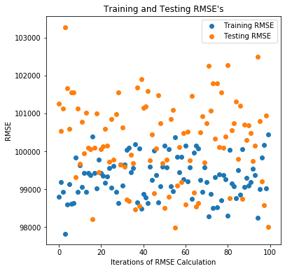
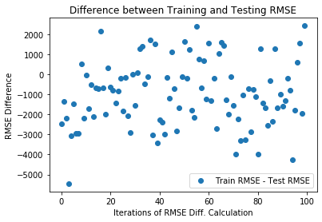
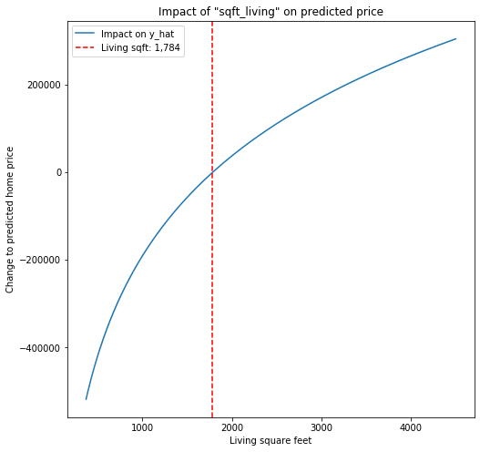
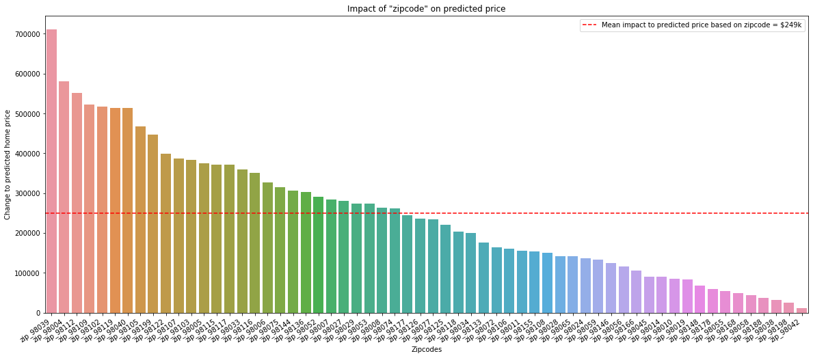
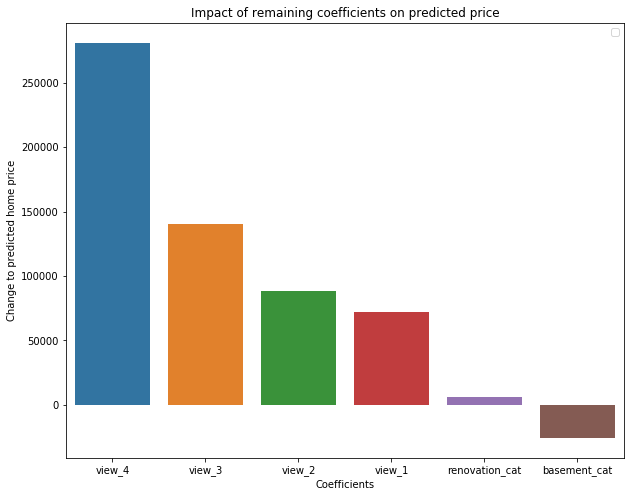

# Location, location, location: Is zipcode a strong predictor of home price? 
## A multi-linear regression model for home price prediction

**Author**: Kevin Giroux

The contents of this repository detail an analysis of the Module 2 project. This analysis is detailed in hopes of making the work accessible and replicable.


### Introduction and Business problem:

This analysis was performed for a real estate investment firm, with the goal of helping them to accurately price and sell homes in their inventory, with the secondary goal of providing insight into how various other factors affect the sale price of home, with particular interest in the 'zipcode' variable. In other words, my primary goal was to optimize the model for price prediction, and my secondary goal was to assess the various coefficients in the final model for further insight.  

From a peronal learning standpoint, I was curious whether or not the creation of dummy variables for each individual zipcode would enhance my model's prediction power or result in over-fitting my model to my training data.


### Data
For this analysis, I used the King County House Sales dataset, which details the many physical attributes and the corresponding sale prices of a series of approximately 21k homes, all located in the Seattle, Washington area. See below for additional detail on the data:

- Sale dates: all homes in the dataset were sold between 2014 and 2015
- Sale price: mean sale price was approx. $540k, with an inner quartile range of $322k to $645k, and a maximum value of $7.7 million
- Bedrooms: most homes have between 2 and 5 bedrooms, with outliers going up to 11 bedrooms
- Bathrooms: most homes have between 1 and 4 bathrooms, including half and three-quarter bathrooms
- Living sqft: the mean living square-footage for homes in our dataset is 1910 sqft, with an inner quartile range of 1430 to 2550 sqft, and a max value of 13,540 sqft
- Lot sqft: the inner quartile range for lot sqare-footage was approx. 5000 to 10,000 sqft, with a maximum value of 1.65 million sqft
- Floors: most homes have 1 or 2 floors, with a max value of 3.5 floors
- Waterfront: dummy variable representing whether the home is on the water
- View: values range from 0 to 4, representing the number of rooms in the home with a view
- Condition: a 1 to 5 rating of the home's condition, approx. 60% are rated as 3, approx. 30% as 4, and approx 10% as 5
- Grade: a more formal rating of the home's condition, based on local governement policy; ratings range from 1 to 13, with the vast majority of homes earning a score between 6 and 10
- Above ground sqft: mean above ground square-footage of 1560 sqft, inner quartile range of 1190 to 2210 sqft, max value of 9410 sqft
- Basement sqft: mode of 0, indicating most homes don't have basements
- Year built: most homes were build between 1950 and 2000, but the full range extends from 1900 to 2015
- Year renovated: mode of 0, indicating most homes have not been renovated
- Zipcode: the zipcode location of each house
- Lat + Long: the latitudinal and longitudinal coordinates for each house
- Neighbors: the square-footages of the nearest 15 homes AND their respective lots, for each house


## Methods
- Descriptive analysis: a review of each feature included in the original dataset
- Data cleaning: this primarily consisted of the removal of outliers from each of the features
- Feature engineering: assessment of multicollinearity between independent variables, log-transformation and normalization of certain continuous variables, generation of dummy variables from categorical features
- Model fitting: creation of train and test data sub-groups, both recursive and forward stepwise feature selection to identify optimal feature set, removal of non-statistically significant predictor variables from the model
- Regression assumptions: analysis of CONTINUOUS independent variables to explore/confirm whether or not the assumptions of linearity, homoskedasticity, independence, and normality hold
- Model validation and cross-validation: comparison of the calculated RMSE's of our model run off of training and testing data, respectively; k-folds cross-validation analysis
- Further exploration: experimental removal of certain features to confirm the final model is in fact the best model
- Exploration of select coefficients and their real-world implications


## Results

### Here are examples of how to embed images from your sub-folder


#### Visual 1

> The final model was able to predict the sale price of a home with a RMSE of approximately $100k.

#### Visual 2

> The difference between the Test and Training RMSE was generally within $3k, confirming the model's ability to predict home prices within $100k of the actual home price.

#### Visual 3

> The effect of living square-footage on the predicted price of a home.

#### Visual 4

> The effect of zip code on the predicted price of a home.

#### Visual 5

> The effect of (1) number of rooms with a view and dummy variables for (2) whether or not the house has been renovated and (3) whether or not the house has a basement on the predicted price of a home.


## Conclusions:

- My model predicts home sale price with a RMSE of approximately $99k (the standard deviation of the model's prediction around the actual sale price of a given home)
- The difference between my training and test RMSE's is generally between $0 and $3000, indicating the model is as successful at predicting home prices based on testing data
- Zipcode is a strong predictor of price with most zipcode dummy variables appearing as statistically significant predictors within our model
- The predicted price boost from having 4 rooms with a view is almost double the predicted price boost of having 3 rooms with a view
- Other factors significant to the prediction of home price, which the firm should keep in mind, include living square footage, lot square footage, the presence of a basement, home condition, number of bedrooms, number of floors, year built, and whether or not the home has had a renovation


## Limitations & Next Steps

1. Limitations:  Most of the features in the provided dataset had outliers, which, for the purposes of prediction accuracy, needed to be removed.  As a result the model is best suited to predict the prices of homes with the following characteristics: 

- Price:  $0 to $1.3mm
- Bedrooms:  0 to 6
- Living space:  0 to 4500 square feet
- Lot size:  0 to 17,500 square feet

2. Next Steps:  
- Derivative analysis of the "Impact of 'sqft_living' on predicted sale price" curve to determine what square-footage has the best "per sqare-foot" unit value (i.e. what living square-footage is the best deal)
- Identify the square-footage that gets the best per-unit pricing for each zipcode; derive a list of target investment properties by filtering for homes of the right square-footage in the highest-value zipcodes that have low "Condition" and "Grade" scores
- An examination of each zipcode variable individually, to ensure sufficient sample sizes have been collected and to confirm that the underlying assumptions of linear regression are upheld across the board

### For further information
Please review the narrative of our analysis in [our jupyter notebook](./student.ipynb) or review our [presentation](./presentation.pdf)

For any additional questions, please contact **kevinsgiroux@gmail.com)


##### Repository Structure:

├── README.md                 <- The top-level README for reviewers of this project
├── student.ipynb             <- narrative documentation of analysis in jupyter notebook
├── presentation.pdf          <- pdf version of project presentation
├── data                      <- raw data and column description files
├── other                     <- other ancillary files included in the originally forked repo
└── images
    └── images                <- both sourced externally and generated from code

```
